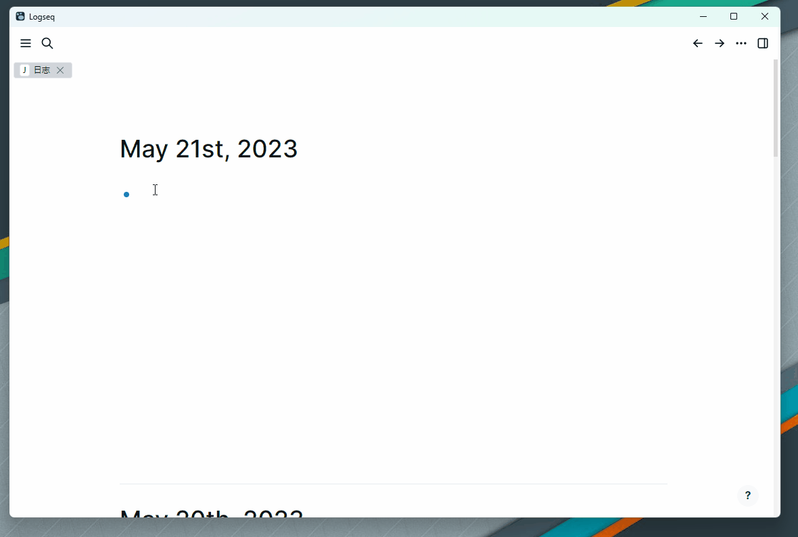

# Logseq Drawio Plugin

Using drawio diagrams in Logseq.

## Features

- Create drawio file
- Import exiting drawio file
- Preview in block and in maximize layout
- multiple drawio theme support
- dark mode support
- download drawio file in logseq, both in svg and drawio file

## How to get started
1. Clone the repository and submodule.
2. Make sure you have pnpm installed, [install](https://pnpm.io/installation) if necessary 🛠
3. Execute `pnpm install` 📦
4. Change the plugin-name in `package.json` to your liking. Adapt both the package-name and the plugin-id at the bottom of the `package.json`. Make sure that they are not conflicting with plugins you already installed. 📝
5. Execute `pnpm build` to build the plugin 🚧
6. Enable developer-mode in Logseq, go to plugins, select "Load unpacked plugin" 🔌
7. Select the directory of your plugin (not the `/dist`-directory, but the directory which includes your package.json) 📂
8. Enjoy! 🎉
